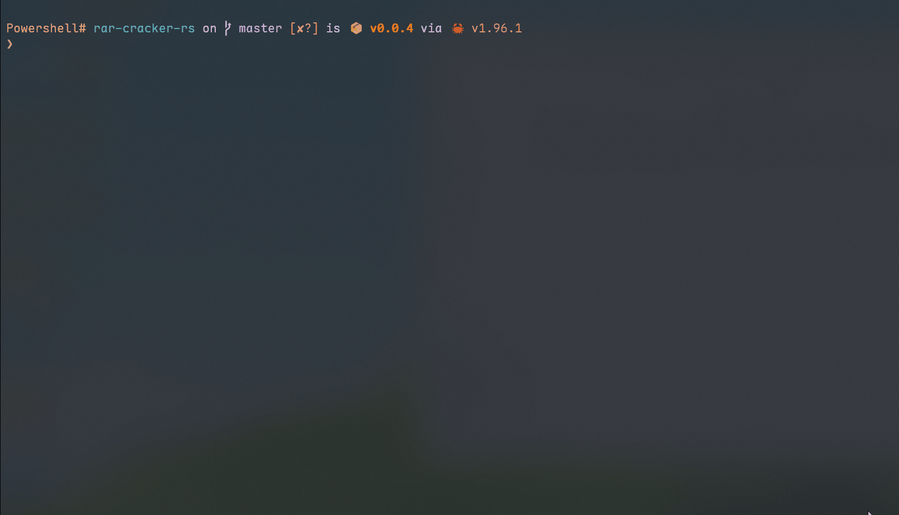

# rar-cracker-rs

> RAR 密码暴力破解工具 — Rust 实现，多线程，带实时进度条与两阶段验证



## 功能特点

- 🔢 **4 位数字暴力破解** — 自动尝试 `0000`–`9999`（10,000 种组合，数秒完成）
- 📖 **内嵌常用密码字典** — 编译时嵌入 `password_list.txt`，无需外部文件即可使用
- 📂 **用户自定义字典** — 支持指定单个字典文件或整个字典目录
- ⚡ **多线程并行** — 基于 Rayon 自动利用所有 CPU 核心
- 📊 **实时进度条** — 显示进度百分比、尝试次数、当前速度与正在测试的密码
- ✅ **两阶段验证** — `unrar` crate 快速扫描 + `UnRAR.exe` 命令行最终确认（100% 准确）
- 📦 **内嵌 UnRAR.exe** — Windows 下自动释放内嵌的 `UnRAR.exe`，无需手动安装
- 🎨 **彩色输出** — 阶段标题、成功/错误信息、进度数据均有颜色区分

## Quick Start

### 直接下载

从 [Releases](../../releases) 页面下载预编译的 Windows 可执行文件，解压后直接运行：

```powershell
.\rar-cracker-rs.exe encrypted.rar
```

### 从源码编译

```powershell
# 编译
cargo build --release

# 运行
.\target\release\rar-cracker-rs.exe encrypted.rar
```

Linux 用户：

```bash
cargo build --release
./target/release/rar-cracker-rs encrypted.rar
```

## 使用说明

### 基本用法

```powershell
# 使用内嵌字典 + 数字穷举自动破解（默认）
.\rar-cracker-rs.exe encrypted.rar

# 指定字典文件（跳过数字穷举和内嵌字典）
.\rar-cracker-rs.exe encrypted.rar --dictionary rockyou.txt

# 使用整个字典目录
.\rar-cracker-rs.exe encrypted.rar --dictionary-dir ./wordlists/

# 指定线程数
.\rar-cracker-rs.exe encrypted.rar --threads 8
```

### 命令行参数

| 参数 | 说明 |
|------|------|
| `<FILE>` | RAR 文件路径（必填） |
| `-d`, `--dictionary <FILE>` | 字典文件路径（指定后跳过数字穷举和内嵌字典） |
| `-D`, `--dictionary-dir <DIR>` | 字典目录路径，使用该目录下所有文件（指定后跳过数字穷举和内嵌字典） |
| `-t`, `--threads <N>` | 线程数，默认自动检测 CPU 核心数 |
| `-h`, `--help` | 显示帮助信息 |
| `-V`, `--version` | 显示版本信息 |

## 破解流程

### 未指定字典参数（默认模式）

```
阶段1: 🔢 4位数字暴力破解
  → 尝试 0000-9999（10,000 种组合）
  → 带实时进度条

阶段2: 📖 内嵌字典破解
  → 自动使用 password_list.txt（约 6,070 个常用密码）
  → 带实时进度条

失败提示: 💡 建议使用 --dictionary 指定更大的字典文件
```

### 指定了 `--dictionary` 或 `--dictionary-dir`

```
[跳过] 阶段1: 数字穷举
[跳过] 阶段2: 内嵌字典
阶段3: 📂 用户指定字典文件（--dictionary）
  → 或

阶段4: 📁 用户指定字典目录（--dictionary-dir）
  → 遍历目录下所有文件作为字典
```

> **设计意图**：用户主动提供字典说明心中有目标，不应该被内置的 1 万次数字穷举拖延时间，直接使用用户提供的字典更高效。

## 验证机制

采用**两阶段验证**确保密码 100% 准确：

```
阶段1 — unrar crate（快速扫描）
  → Archive::open_for_processing()
  → 遍历所有文件执行 test() 完整性检查
  → 速度快，但有误判可能

阶段2 — UnRAR.exe（100% 确认）
  → unrar t <file> -p<password>
  → 退出码 0 表示密码正确
  → Windows 下自动释放内嵌的 UnRAR.exe
  → Linux/macOS 需先安装 unrar 命令行工具
```

## 项目结构

```
rar-cracker-rs/
├── src/
│   ├── main.rs         # 入口：CLI 解析与阶段编排
│   ├── cli.rs          # CLI 参数定义（clap）
│   ├── cracker.rs      # 破解引擎：数字穷举 + 字典攻击 + 进度条
│   ├── dictionary.rs   # 字典加载：文件读取、内嵌列表
│   ├── password.rs     # 密码验证：crate 扫描 + UnRAR 确认
│   └── style.rs        # 终端彩色输出
├── scripts/
│   ├── build-release.ps1   # Windows 发布构建脚本
│   └── build-release.sh    # Linux 发布构建脚本
├── build.rs            # 构建时元信息注入（target、git commit、日期）
├── password_list.txt   # 内嵌字典（约 6070 个常用密码）
├── UnRAR.exe           # 内嵌的 UnRAR 命令行工具（Windows）
└── Cargo.toml
```

## 编译说明

### Windows

使用发布脚本一键构建：

```powershell
.\scripts\build-release.ps1
```

输出到 `dist/` 目录，文件名为 `rar-cracker-rs_v<version>_x86_64-pc-windows-msvc.exe`。

### Linux / macOS

使用发布脚本一键构建：

```bash
chmod +x scripts/build-release.sh
./scripts/build-release.sh
```

输出到 `dist/` 目录，文件名为 `rar-cracker-rs_v<version>_x86_64-unknown-linux-gnu`。

手动编译：

```bash
# 安装依赖
sudo apt install unrar      # Ubuntu/Debian
sudo yum install unrar      # CentOS/RHEL
sudo pacman -S unrar        # Arch Linux

# macOS
brew install unrar

# 编译
cargo build --release

# 运行
./target/release/rar-cracker-rs encrypted.rar
```

## 技术栈

| 依赖 | 用途 |
|------|------|
| [clap](https://crates.io/crates/clap) (v4) | CLI 参数解析 |
| [rayon](https://crates.io/crates/rayon) (v1) | 并行数据遍历 |
| [unrar](https://crates.io/crates/unrar) (v0.5) | RAR 文件处理 |
| [walkdir](https://crates.io/crates/walkdir) (v2) | 递归目录遍历 |
| [colored](https://crates.io/crates/colored) (v3) | 终端彩色输出 |

## License

MIT